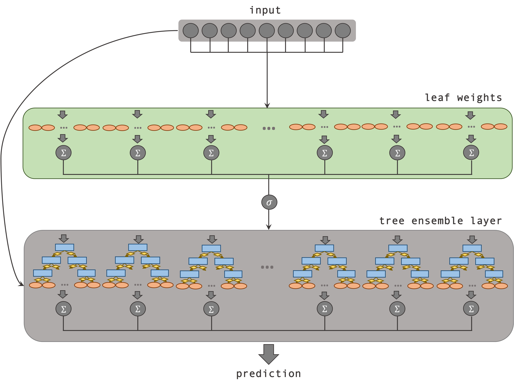
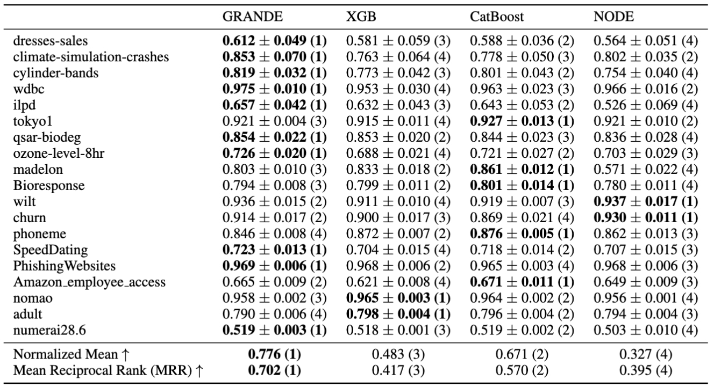

# 🌳 GRANDE: Gradient-Based Decision Tree Ensembles 🌳

[](https://pypi.org/project/GRANDE/) [](https://openreview.net/forum?id=XEFWBxi075) [](https://arxiv.org/abs/2309.17130)

🌳 GRANDE is a novel gradient-based decision tree ensemble method for tabular data!

<div align="center">



<p><strong>Figure 1: Overview GRANDE.</strong> GRANDE is a gradient-based decision tree ensemble that utilizes dynamic, instance-wise leaf weights. Each estimator is weighted based on leaf weights that are calculated individually for each input. The ensemble's prediction is then obtained as a weighted sum of the individual predictions.</p>

</div>

🔍 What's new?
- End-to-end gradient descent for tree ensembles.
- Combines inductive bias of hard, axis-aligned splits with the flexibility of a gradient descent optimization.
- Advanced instance-wise weighting to learn representations for both simple & complex relations in one model.

🏆 Results? We outperformed leading tree ensemble methods like #XGBoost and #CatBoost on many datasets.

<div align="center">



<p><strong>Figure 2: Performance Comparison.</strong> We report the test macro F1-score (mean ± stdev for a 5-fold CV) with optimized parameters. The datasets are sorted based on the data size.</p>

</div>

📝 More details on the method can be found in our paper available under: https://openreview.net/forum?id=XEFWBxi075

## Installation
To download the latest official release of the package, use the pip command below:
```bash
pip install GRANDE
```
More details can be found under: https://pypi.org/project/GRANDE/

## Cite us

```
@inproceedings{
marton2024grande,
title={{GRANDE}: Gradient-Based Decision Tree Ensembles},
author={Sascha Marton and Stefan L{\"u}dtke and Christian Bartelt and Heiner Stuckenschmidt},
booktitle={The Twelfth International Conference on Learning Representations},
year={2024},
url={https://openreview.net/forum?id=XEFWBxi075}
}
```


## Usage
Example usage is in the following or available in the jupyter notebook files. Please note that a GPU is required to achieve competitive runtimes. Also, please set 'objective' to 'binary', 'classification' or 'regression' based on your task.

### Enable and specify GPU
```python
import os
os.environ['CUDA_VISIBLE_DEVICES'] = '0'
os.environ['TF_FORCE_GPU_ALLOW_GROWTH'] = 'true'
```

### Load Data
```python
from sklearn.model_selection import train_test_split
import openml

dataset = openml.datasets.get_dataset(40536)
X, y, categorical_indicator, attribute_names = dataset.get_data(target=dataset.default_target_attribute)
categorical_feature_indices = [idx for idx, idx_bool in enumerate(categorical_indicator) if idx_bool]

X_temp, X_test, y_temp, y_test = train_test_split(X, y, test_size=0.2, random_state=42)

X_train, X_valid, y_train, y_valid = train_test_split(X_temp, y_temp, test_size=0.2, random_state=42)
```

### Preprocessing, Hyperparameters and Training 
GRANDE requires categorical features to be encoded appropriately. The best results are achieved using Leave-One-Out Encoding for high-cardinality categorical features and One-Hot Encoding for low-cardinality categorical features. Furthermore, all features should be normalized using a quantile transformation. Passing the categorical indices to the model wil automatically preprocess the data accordingly.

In the following, we will train the model using the default parameters. GRANDE already archives great results with its default parameters, but a HPO can increase the performance even further. An appropriate grid is specified in the model class.

```python
from GRANDE import GRANDE

params = {
        'depth': 5, # tree depth
        'n_estimators': 2048, # number of estimators / trees

        'learning_rate_weights': 0.005, # learning rate for leaf weights
        'learning_rate_index': 0.01, # learning rate for split indices
        'learning_rate_values': 0.01, # learning rate for split values
        'learning_rate_leaf': 0.01, # learning rate for leafs (logits)

        'optimizer': 'adam', # optimizer
        'cosine_decay_steps': 0, # decay steps for lr schedule (CosineDecayRestarts)

        'loss': 'crossentropy', # loss function (default 'crossentropy' for binary & multi-class classification and 'mse' for regression)
        'focal_loss': False, # use focal loss {True, False}
        'temperature': 0.0, # temperature for stochastic re-weighted GD (0.0, 1.0)

        'from_logits': True, # use logits for weighting {True, False}
        'use_class_weights': True, # use class weights for training {True, False}

        'dropout': 0.0, # dropout rate (here, dropout randomly disables individual estimators of the ensemble during training)

        'selected_variables': 0.8, # feature subset percentage (0.0, 1.0)
        'data_subset_fraction': 1.0, # data subset percentage (0.0, 1.0)
}

args = {
    'epochs': 1_000, # number of epochs for training
    'early_stopping_epochs': 25, # patience for early stopping (best weights are restored)
    'batch_size': 64,  # batch size for training

    'cat_idx': categorical_feature_indices, # put list of categorical indices
    'objective': 'binary', # objective / task {'binary', 'classification', 'regression'}
    
    'random_seed': 42,
    'verbose': 1,       
}

model_grande = GRANDE(params=params, args=args)

model_grande.fit(X_train=X_train,
          y_train=y_train,
          X_val=X_valid,
          y_val=y_valid)

preds_grande = model_grande.predict(X_test)

```

### Evaluate Model

```python
preds = model_grande.predict(X_test)

if args['objective'] == 'binary':
    accuracy = sklearn.metrics.accuracy_score(y_test, np.round(preds_grande[:,1]))
    f1_score = sklearn.metrics.f1_score(y_test, np.round(preds_grande[:,1]), average='macro')
    roc_auc = sklearn.metrics.roc_auc_score(y_test, preds_grande[:,1], average='macro')
    
    print('Accuracy:', accuracy)
    print('F1 Score:', f1_score)
    print('ROC AUC:', roc_auc)
elif args['objective'] == 'classification':
    accuracy = sklearn.metrics.accuracy_score(y_test, np.argmax(preds_grande, axis=1))
    f1_score = sklearn.metrics.f1_score(y_test, np.argmax(preds_grande, axis=1), average='macro')
    roc_auc = sklearn.metrics.roc_auc_score(y_test, preds_grande, average='macro', multi_class='ovo', labels=[i for i in range(preds_grande.shape[1])])

    print('Accuracy GRANDE:', accuracy)
    print('F1 Score GRANDE:', f1_score)
    print('ROC AUC GRANDE:', roc_auc)
else:
    mean_absolute_error = sklearn.metrics.mean_absolute_error(y_test, np.round(preds_grande))
    r2_score = sklearn.metrics.r2_score(y_test, np.round(preds_grande))

    print('MAE GRANDE:', mean_absolute_error)
    print('R2 Score GRANDE:', r2_score)
```

## More

Please note that this is an experimental implementation which is not fully tested yet. If you encounter any errors, or you observe unexpected behavior, please let me know.
